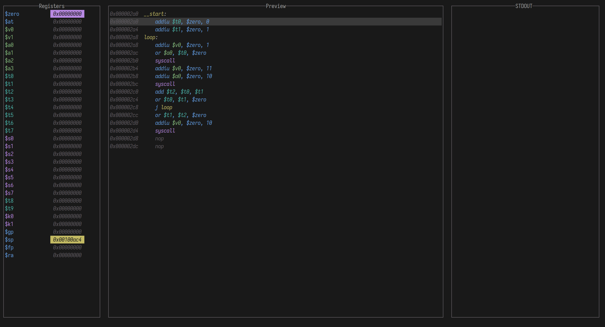

# Greg

Greg is a VM for the MIPS32 architecture.

## References

- [MIPS Encoding Reference](https://student.cs.uwaterloo.ca/~isg/res/mips/opcodes) - Great opcode reference, gives roughly C-equivalents for each opcode
- [OSDev MIPS overview](https://wiki.osdev.org/MIPS_Overview#Instruction_fields)
- [MIPS Instruction Formats](https://en.wikibooks.org/wiki/MIPS_Assembly/Instruction_Formats#I_Instructions)
- [MARS Syscall Documentation](https://dpetersanderson.github.io/Help/SyscallHelp.html)
- [MIPS32™ Architecture For Programmers Volume II: The MIPS32™ Instruction Set](https://www.cs.cornell.edu/courses/cs3410/2014sp/MIPS_Vol2.pdf)
